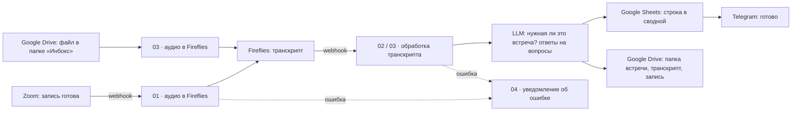

# Разбор клиентских встреч на n8n: запись → транскрипт → таблица

> Пример проекта: шаблоны воркфлоу, которые работали в сервисной компании.
> Имена сотрудников, идентификаторы, адреса и названия услуг вымышлены
> или заменены заглушками `YOUR_…`.

Менеджеры компании регулярно проводят с клиентами обзорные встречи:
спрашивают, доволен ли клиент, что его беспокоит, чем ещё компания может быть
полезна. Раньше результат такой встречи оставался в голове менеджера. Записи
никто не пересматривал, а сравнить ответы разных клиентов было невозможно.

Эти воркфлоу делают из каждой записи строку в общей Google-таблице: кто провёл
встречу, с кем, ответы клиента на вопросы чек-листа, договорённости, сводка о компании
и зоны роста. Запись и транскрипт складываются в папку встречи на Google Drive.
Человек в процессе не участвует: менеджер заканчивает звонок, через несколько
минут в Telegram приходит сообщение со ссылкой на папку.

В работе система расшифровала и разобрала более 80 встреч.

Тип встречи и вопросы в шаблоне усреднены. Они собраны в один блок настроек
в начале узла `Build Prompt`: впишите название своей встречи, свои услуги
и свои вопросы, и колонки таблицы подстроятся сами.

## Как это устроено

Два входа, одна обработка:

- **Zoom.** Когда облачная запись готова, Zoom шлёт вебхук. Воркфлоу 01 берёт
  аудиодорожку и отдаёт её в Fireflies на расшифровку. Когда транскрипт готов,
  Fireflies шлёт вебхук в воркфлоу 02.
- **Google Drive.** Встречи, записанные не в Zoom (диктофон, другой сервис),
  менеджер кладёт файлом в папку «Инбокс». Воркфлоу 03 раз в минуту забирает
  новые файлы, отправляет их в Fireflies и сам же обрабатывает результат.

Дальше оба пути делают одно и то же: забирают транскрипт, спрашивают у модели,
та ли это встреча, извлекают ответы, создают папку встречи, дописывают строку
в таблицу и сообщают в Telegram.

## Воркфлоу

| Файл | Что делает | Запуск |
|---|---|---|
| [`01-zoom-recording-to-fireflies`](workflows/01-zoom-recording-to-fireflies.json) | Принимает вебхук Zoom `recording.completed`, проходит проверку адреса (CRC), отправляет аудио в Fireflies | вебхук |
| [`02-zoom-transcript-to-sheet`](workflows/02-zoom-transcript-to-sheet.json) | Забирает транскрипт и список участников Zoom, извлекает ответы моделью, пишет строку, раскладывает файлы по папке встречи | вебхук |
| [`03-drive-inbox-pipeline`](workflows/03-drive-inbox-pipeline.json) | То же для файлов из папки «Инбокс»; встречи другого типа уносит в «Другие встречи» | раз в минуту + вебхук |
| [`04-error-notifications`](workflows/04-error-notifications.json) | Сообщает в Telegram, какой воркфлоу упал, на каком узле и с какой ошибкой | при ошибке |
| [`05-backup-workflows-to-github`](workflows/05-backup-workflows-to-github.json) | Раз в сутки выгружает все воркфлоу через API n8n и коммитит их в репозиторий | 03:00 |
| [`06-zoom-cloud-backfill`](workflows/06-zoom-cloud-backfill.json) | Разовый прогон: отправляет в Fireflies записи из облака Zoom за заданный период | вручную |
| [`07-sheet-backfill`](workflows/07-sheet-backfill.json) | Разовый прогон: заново извлекает часть полей для уже записанных строк после правки промпта | вручную |

## Решения, на которые стоит посмотреть

- **Модель сначала решает, та ли это встреча.** Через тот же Zoom идут планёрки
  и онбординги. Промпт сперва классифицирует встречу и только для нужного типа
  заполняет поля; остальное в таблицу не попадает.
- **Ответы ищутся по смыслу, а не по порядку вопросов.** Клиент отвечает раньше
  вопроса, возвращается к теме через полчаса, отвечает намёком. Промпт требует
  собирать ответ по всему транскрипту и оставлять поле пустым, если тема лишь
  упомянута.
- **Кто менеджер, а кто клиент.** Модель получает список сотрудников со всеми
  формами имени и подсказку: участников из Zoom или имя из названия файла.
  Отдельное правило закрывает совпадение имён: клиент с именем из списка
  остаётся клиентом, менеджером считается тот, кто ведёт встречу и задаёт вопросы.
  Ответ модели затем приводится к каноническому имени уже кодом, чтобы в таблице
  не было «Аня», «Анна» и «Соколова» в разных строках.
- **Просьбы клиента и выводы модели разведены.** То, что клиент попросил сам,
  идёт в одно поле; предположения модели о зонах роста идут в другое и
  помечаются как предположения.
- **Проверка адреса Zoom без внешних библиотек.** В узле Code по умолчанию недоступен модуль
  `crypto`, поэтому HMAC-SHA256 для ответа на проверку написан прямо в узле.
- **Сбой не проходит молча.** У рабочих воркфлоу назначен общий обработчик
  ошибок, а пустой транскрипт считается ошибкой с понятным текстом, а не тихим
  пропуском. Ошибка модели (лимит, пустой или неразборчивый ответ) тоже
  останавливает воркфлоу с сообщением, а не выдаётся за «встречу другого типа».
- **Запросы к API собраны в узлах HTTP Request**, а не в готовых узлах сервисов:
  так видно каждое поле запроса к Fireflies, Zoom и модели, и их легко менять.

## Что получается на выходе

Строка в листе «Встречи — Сводная» (пример вымышлен):

| Поле | Значение |
|---|---|
| Дата встречи | 2026-01-14 |
| Имя контакта | Игорь |
| Менеджер | Анна |
| Длительность (мин) | 42 |
| Оценка и удовлетворённость | 8 из 10. Доволен скоростью ответов, беспокоит прозрачность отчётов |
| Задачи у других подрядчиков | Два сайта ведёт штатный специалист: «так исторически сложилось» |
| Предложения и пожелания клиента | Просит ежемесячный созвон вместо письменного отчёта |
| Договорённости / Next Steps | До 20.01 прислать пример нового отчёта |
| О компании | Сеть из шести стоматологий в двух городах, в этом году открывают седьмую |
| Перспективы и зоны роста | Предположение: новой клинике понадобится продвижение на картах |
| Папка встречи | ссылка на папку с транскриптом, видео и аудио |

Колонки с ответами берутся из списка `QUESTIONS`, остальные задаются в узлах
`Parse` и `Build Row`.

## Как запустить у себя

Нужны: свой n8n (проверялось на self-hosted), аккаунты Zoom с облачной записью,
Fireflies с доступом к API, ключ OpenAI-совместимой модели, Google Drive
и Sheets, Telegram-бот.

1. Импортируйте файлы из `workflows/` в n8n. Начните с 04: его идентификатор
   понадобится остальным.
2. Создайте учётные данные и выберите их в узлах:

   | Имя в шаблоне | Тип в n8n | Где используется |
   |---|---|---|
   | Fireflies API | Header Auth (`Authorization: Bearer …`) | 01, 02, 03, 06, 07 |
   | Zoom | OAuth2 API | 02 |
   | Zoom S2S Basic | Basic Auth (Client ID и Secret приложения Server-to-Server) | 06 |
   | OpenAI account | OpenAI | 02, 03, 07 |
   | Google Drive account | Google Drive OAuth2 | 02, 03 |
   | Google Sheets account | Google Sheets OAuth2 | 02, 03, 07 |
   | Telegram account | Telegram | 01–04, 06, 07 |
   | n8n account, GitHub account | n8n API, GitHub | 05 |

3. Замените заглушки. Поиск по `YOUR_` в файле покажет все места.

   | Заглушка | Что подставить |
   |---|---|
   | `YOUR_ZOOM_WEBHOOK_SECRET_TOKEN` | Secret Token приложения Zoom, которое шлёт вебхук |
   | `YOUR_SHARED_DRIVE_ID` | общий диск Google Drive |
   | `YOUR_MEETINGS_FOLDER_ID` | папка, где создаются папки встреч |
   | `YOUR_INBOX_FOLDER_ID`, `YOUR_PROCESSING_FOLDER_ID`, `YOUR_OTHER_MEETINGS_FOLDER_ID` | папки «Инбокс», «_processing», «Другие встречи» |
   | `YOUR_GOOGLE_SHEET_ID` | таблица с листом «Встречи — Сводная» |
   | `YOUR_TELEGRAM_CHAT_ID` | чат для уведомлений |
   | `YOUR_ERROR_WORKFLOW_ID` | идентификатор импортированного воркфлоу 04 |
   | `https://n8n.example.com` | адрес вашего n8n |
   | `YOUR_ZOOM_ACCOUNT_ID`, `zoom-user@example.com` | аккаунт и пользователь Zoom для разового прогона 06 |
   | `your-github-user/your-private-backup-repo` | репозиторий для бэкапов в 05 |
   | `YOUR_DATA_TABLE_ID` | таблица данных n8n для журнала в 07 |

4. В блоке настроек в начале узла `Build Prompt` (02 и 03) задайте тип встречи
   (`MEETING_TYPE`), свои услуги (`OUR_SERVICES`) и вопросы (`QUESTIONS`: ключ,
   колонка таблицы, формулировка). Своих сотрудников впишите в массивы `managers`
   и `MGR` (узлы `Build Prompt` и `Parse` в 02, 03 и 07).
5. В Zoom укажите адрес вебхука `…/webhook/zoom-recording` и событие
   `recording.completed`; в Fireflies укажите вебхук `…/webhook/fireflies-transcript`.
6. Включите 01–04. Воркфлоу 05–07 запускаются по необходимости.

## Ограничения

- **Файлы из «Инбокса» открываются по ссылке.** Чтобы Fireflies мог скачать
  запись с Google Drive, воркфлоу 03 выдаёт доступ на чтение всем, у кого есть
  ссылка, и после обработки его не отзывает. Для чувствительных записей добавьте
  отзыв доступа после получения транскрипта.
- **Подпись входящих вебхуков не проверяется.** Воркфлоу 01 отвечает на проверку
  адреса Zoom, но заголовок `x-zm-signature` у событий не сверяет; вебхуки
  Fireflies тоже принимаются без аутентификации. Адреса вебхуков стоит держать
  закрытыми, а для боевого запуска добавить проверку подписи.
- **Повторный вебхук создаёт дубликат.** Воркфлоу 02 и 03 не проверяют, была ли
  встреча уже обработана: повтор события даст вторую строку и вторую папку.
- **Разовые прогоны без постраничной выборки.** Воркфлоу 05 берёт до 250
  воркфлоу, 06 — до 300 записей Zoom за запуск; на больших объёмах прогон
  нужно повторять по периодам.
- **Секрет Zoom лежит в коде узла,** а значит попадает в выгрузку воркфлоу.
  Репозиторий для бэкапов из воркфлоу 05 должен быть приватным.
- **Список сотрудников продублирован** в нескольких узлах: общих переменных
  между узлами Code в n8n нет. При изменении состава править нужно все копии.
- **Часовой пояс зашит как UTC+3.**
- **Ответы модели не полностью воспроизводимы.** После правки промпта старые
  строки пересчитываются воркфлоу 07, и результат может немного отличаться.
- Колонка «Клиент» заполняется вручную: название компании из разговора
  определяется ненадёжно.

## Стек

n8n · Zoom API · Fireflies GraphQL API · OpenAI Chat Completions · Google Drive ·
Google Sheets · Telegram Bot API · GitHub API

## Лицензия

MIT, см. [`LICENSE`](LICENSE).
